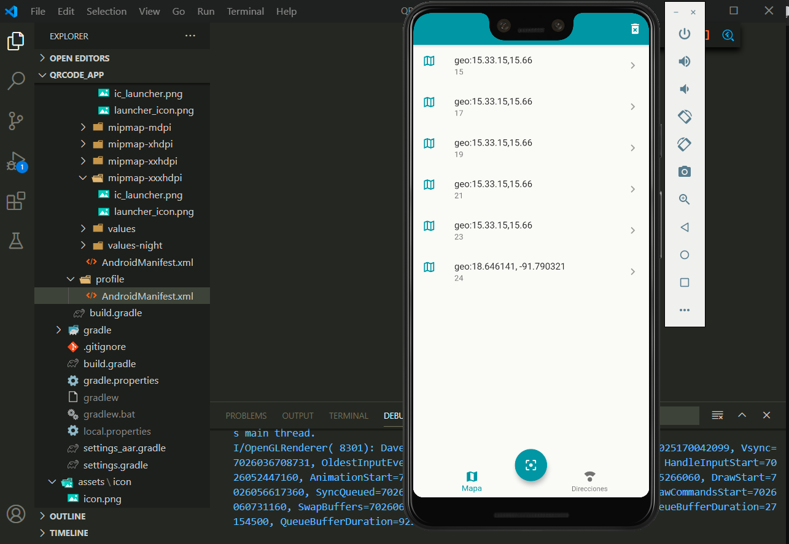

# QR Code App

A new Flutter project.

Link Download Apk or application

<a href="https://drive.google.com/file/d/1W0PBFDMnx-_fL6HgmpxMK_AZTUaJsV6o/view?usp=sharing">Qr App</a>

## References

<h3>Packages</h3>

<ul>
<li><a href="https://pub.dev/packages/sqflite">sqflite</a></li>
<li><a href="https://pub.dev/packages/path_provider">path_provider</a></li>
<li><a href="https://pub.dev/packages/provider">provider</a></li>
<li><a href="https://pub.dev/packages/google_maps_flutter">google_maps_flutter</a></li>
<li><a href="https://pub.dev/packages/url_launcher">url_launcher</a></li>
<li><a href="https://pub.dev/packages/flutter_barcode_scanner">flutter_barcode_scanner</a></li>
</ul>

 

 
 

## Getting Started

This project is a starting point for a Flutter application.

A few resources to get you started if this is your first Flutter project:

- [Lab: Write your first Flutter app](https://flutter.dev/docs/get-started/codelab)
- [Cookbook: Useful Flutter samples](https://flutter.dev/docs/cookbook)

For help getting started with Flutter, view our
[online documentation](https://flutter.dev/docs), which offers tutorials,
samples, guidance on mobile development, and a full API reference.
